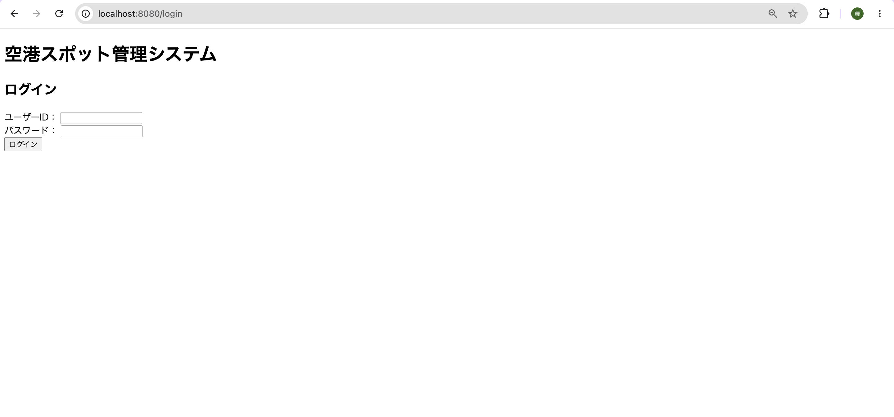
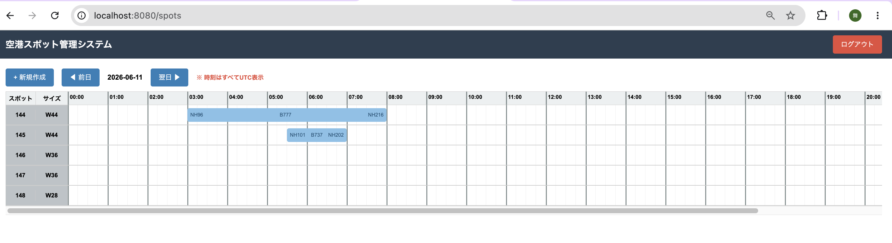
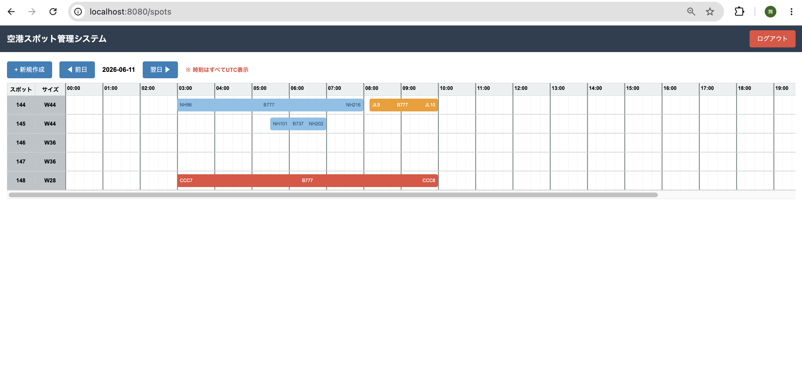
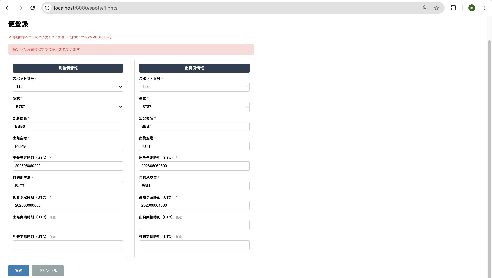
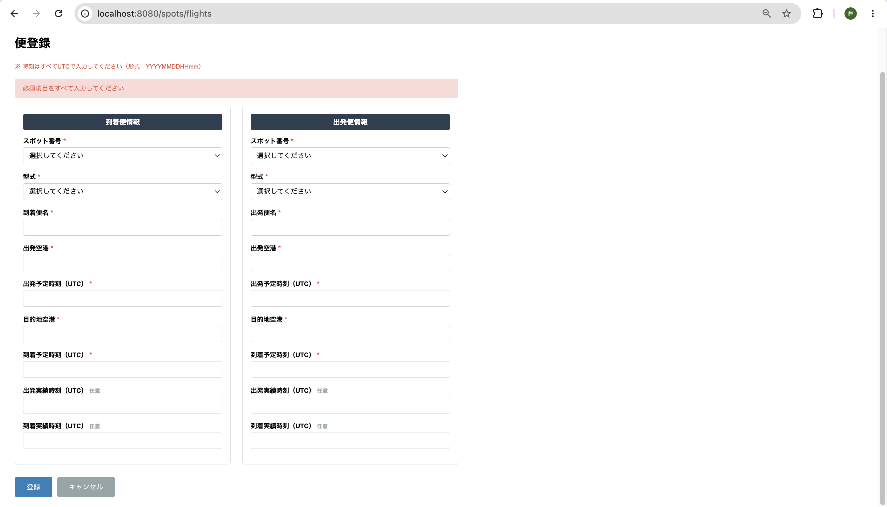

# 空港スポット管理システム

## 概要

航空機が駐機するスポットの使用状況を管理するWebアプリケーションです。

前職で運航情報官として空港運用業務に携わった経験をもとに、実際の運用を参考にしながら開発しました。

スポット割当業務では、

* 航空機サイズとスポット制限の確認
* 駐機時間の重複確認
* 前後便とのインターバル確認

などが必要となります。

本システムでは、これらの業務ルールをシステム上で可視化し、担当者の判断を支援することを目的としています。

## システム構成

* フロントエンド：Thymeleaf / HTML / CSS / JavaScript
* バックエンド：Spring Boot
* データベース：PostgreSQL
* 認証：Spring Security
* インフラ：AWS EC2 / AWS RDS
* バージョン管理：Git / GitHub

## 主な機能

### ログイン・ログアウト

Spring Securityを利用した認証機能

### スポット管理画面

時間軸上に便情報をバー形式で表示し、スポットの使用状況を視覚的に把握できるよう設計

### 便管理

* 新規登録
* 編集
* 削除

### 制約チェック（サイズ・インターバル）

航空機のウィングスパンとスポット制限、および前後便の運航間隔をもとに、
スポット割当の可否判定および警告表示を行う機能

- ウィングスパン > スポット制限：赤色で警告表示
- 前後便の間隔 < 30分：黄色で警告表示

※制約条件はリアルタイムで評価され、登録時に即時反映される

### 時間重複チェック

同一スポットにおいて駐機時間が重複する場合は登録不可

### 必須項目チェック

必須項目が入力されていない場合は登録不可

## 技術スタック

| 区分      | 技術                                  |
| ------- | ----------------------------------- |
| 言語      | Java 21                             |
| フレームワーク | Spring Boot 4.0.5                   |
| フロントエンド | Thymeleaf / HTML / CSS / JavaScript |
| DB（開発）  | H2 Database                         |
| DB（本番）  | PostgreSQL（AWS RDS）                 |
| ビルドツール  | Gradle                              |
| 認証      | Spring Security                     |
| インフラ    | AWS EC2                             |
| バージョン管理 | Git / GitHub                        |

## 起動方法（ローカル）

ブラウザで http://13.159.210.191:8080 にアクセス

### テストアカウント

| ユーザーID | パスワード    |
| ------ | -------- |
| admin  | Admin@2026spot! |

## 設計ドキュメント

* [要件定義書](https://app.notion.com/p/359f77abdfad803ab6ece652b199d6a9?source=copy_link)
* [基本設計書](https://app.notion.com/p/359f77abdfad8025b50bf15cd689f516?source=copy_link)
* [詳細設計書](https://app.notion.com/p/359f77abdfad8074a2b0dd6b97a603cf?source=copy_link)

## 工夫した点

### 実務を意識した警告設計

実際の空港運用では、サイズ超過や短時間インターバルが発生するケースでも、関係部署との調整により運用可能な場合があります。

そのため本システムでは、

* サイズ超過 → エラーではなく警告
* インターバル不足 → エラーではなく警告

として実装し、実運用に近い仕様としました。

### 業務知識を活かしたロジック設計

前職での空港運用経験を活かし、

* スポット制約
* 航空機サイズ
* 時間管理

を考慮した業務ロジックを実装しました。

### 視認性向上

スポット管理画面では、時間軸上に便バーを表示することで、利用状況を直感的に把握できるよう工夫しました。

## 今後の改善予定
* ユーザ登録、管理
* 権限管理機能
* CSV入出力機能
* テストコード拡充
* Docker対応